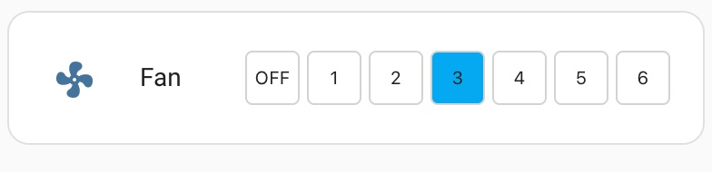
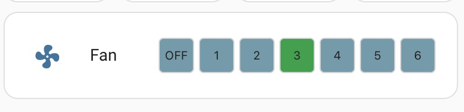

# Fan Percent Button 7 Row

forked from finity69x2/fan-percent-button-row 
 
Provides a means to program six preset speed percentage settings for fans selectable from a Lovelace button row.

## NOTE: You must be on Home Assistant V2021.3.X or higher to use this plug-in. However, if your fan integration hasn't been updated to the new control method (if it doesn't actually use percentages for speeds but still uses a speed list) then you need to use the fan-control-entity-row.

Installation:

***

**NOTE:**

Add this as a custom repository in HACS: Open HACS. Click on one of the sub-headings (integration, frontend, etc) then click the three dots in the top right of the HACS page and copy the URL for the main repo in there at the bottom. Select plugin as the type. It should show up in HACS to be able to be installed at that point.

***

The easiest way to install this is to use the Home Assistant Community Store (HACS) in Home Assistant.

Follow the instructions there for installation making sure you note the "url:" section for the resources addition.


Conversely, if you don't use HACS you can install it manually by performing the following:

Copy the fan-percent-button-7row.js file to the appropriate folder in your Home Assistant Configuration directory (/config/www/).

Place the following in your "resources" section in your lovelace configuration (updating the location to where you placed the above file):

  ```
    - url: /local/fan-percent-button-7row.js
      type: module
  ```
    
Then to use this in a card place the following in your entity card:


<b>Options:</b>

| Name | Type | Required | Default | Description |
| --- | --- | --- | --- | --- |
| entity | String | Yes | none | any fan entity_id |
| type | String | Yes | none | custom:fan-percent-button-row |
| name | String | No | none | A custom name for the entity in the row |
| customTheme | Boolean | No | false | set to true to use a custom theme |
| customSetpoints | Boolean | No | false | set to true to use custom speed percent setpoints |
| reverseButtons | Boolean | No | false | set to true to reverse the button order |
| hideOffButton | Boolean | No | false | Set to true to hide the Off button |
| hideButton1 | Boolean | No | false | Set to true to hide button 1 |
| hideButton2 | Boolean | No | false | Set to true to hide button 2 |
| hideButton3 | Boolean | No | false | Set to true to hide button 3 |
| hideButton4 | Boolean | No | false | Set to true to hide button 4 |
| hideButton5 | Boolean | No | false | Set to true to hide button 5 |
| hideButton6 | Boolean | No | false | Set to true to hide button 6 || sendStateWithSpeed | Boolean | No | false | Used only for certain firmware that requires the State command be sent with the Speed command  |
| allowDisablingButtons | Boolean | No | true | Set to false to prevent buttons being disabled |
| width | String | No | 30px | A custom width for the buttons |
| height | String | No | 30px | A custom height for the buttons |
| isOffColor | String | No | '#f44c09' | Sets the color of the 'Off' button if fan is off |
| speed1Color | String | No | '#43A047' | Sets the color of button 1 if fan is on percent speed 1 |
| speed2Color | String | No | '#43A047' | Sets the color of button 2 if fan is on percent speed 2 |
| speed3Color | String | No | '#43A047' | Sets the color of button 3 if fan is on percent speed 3 |
| speed4Color | String | No | '#43A047' | Sets the color of button 4 if fan is on percent speed 4 |
| speed5Color | String | No | '#43A047' | Sets the color of button 5 if fan is on percent speed 5 |
| speed6Color | String | No | '#43A047' | Sets the color of button 6 if fan is on percent speed 6 |
| buttonInactiveColor | String | No | '#759aaa' | Sets the color of the the buttons if that selection is not "active" |
| button1Percentage | Integer | No | 16 | Sets the speed percentage level for Button 1 (min 1) |
| button2Percentage | Integer | No | 33 | Sets the speed percentage level for Buton 2  |
| button3Percentage | Integer | No | 50 | Sets the speed percentage level for Buton 3  |
| button4Percentage | Integer | No | 66 | Sets the speed percentage level for Buton 4  |
| button5Percentage | Integer | No | 83 | Sets the speed percentage level for Buton 5  |
| button6Percentage | Integer | No | 100 | Sets the speed percentage level for Button 6 (max 100) |
| customOffText | String | No | 'OFF' | Sets the text of the "off" button |
| speed1Text | String | No | '1' | Sets the text of button 1 |
| speed2Text | String | No | '2' | Sets the text of button 2 |
| speed3Text | String | No | '3' | Sets the text of button 3 |
| speed4Text | String | No | '4' | Sets the text of button 4 |
| speed5Text | String | No | '5' | Sets the text of button 5 |
| speed6Text | String | No | '6' | Sets the text of button 6 |


The values for the colors can be any valid color string in "HEX", "RGB" or by color name.

If the speed percantage is changed via any other means (slider, service call, etc) the buttons will indicate which range the speed percentage is in based on the setpoint settings in the config.

<b>Configuration Examples:</b>
    
  ```
    cards:
      - type: entities
        title: Hall Fan Presets
        show_header_toggle: false
        entities:
        ## USE THIS CONFIG TO HAVE IT MATCH YOUR THEME ##
          - entity: fan.hall_fan
            type: custom:fan-percent-button-7row
            name: Fan Not Custom Theme
            customTheme: false
        ## USE THIS CONFIG TO USE A DEFAULT CUSTOM THEME
          - entity: fan.hall_fan
            type: custom:fan-percent-button-7row
            name: Fan Default Custom Theme
            customTheme: true
            customSetpoints: true
            button1Percentage: 10
            button2Percentage: 20
            button3Percentage: 30
            button4Percentage: 40
            button5Percentage: 50
            button6Percentage: 60
        ## USE THIS CONFIG TO USE A 'CUSTOMZED' CUSTOM THEME
          - entity: fan.hall_fan
            type: custom:fan-percent-button-7row
            name: Fan Custom Custom Theme
            reverseButtons: true
            customTheme: true
            speed1Color: 'rgb(255, 0, 0)'
            speed2Color: '#888888'
            speed3Color: '#222222'
            speed4Color: '#222222'
            speed5Color: '#222222'
            speed6Color: '#222222'
            buttonInactiveColor: '#aaaaaa'
            isOffColor: 'purple'
        ## USE THIS CONFIG TO SET CUSTOM BUTTON TEXT (NOT REQUIRED TO SET "customTheme: true" TO USE THESE )
          - entity: fan.hall_fan
            type: custom:fan-percent-button-7row
            name: Fan Custom Button Text
            speed1Text: A
            speed2Text: B
            speed3Text: C
            speed4Text: D
            speed5Text: E
            speed6Text: F
            customOffText: not
            width: '15px'
            height: '15px'
            
            
  ```

This is with the default Lovelace frontend theme set and buttons reversed:



This is with the customTheme set to true and buttons reversed:




